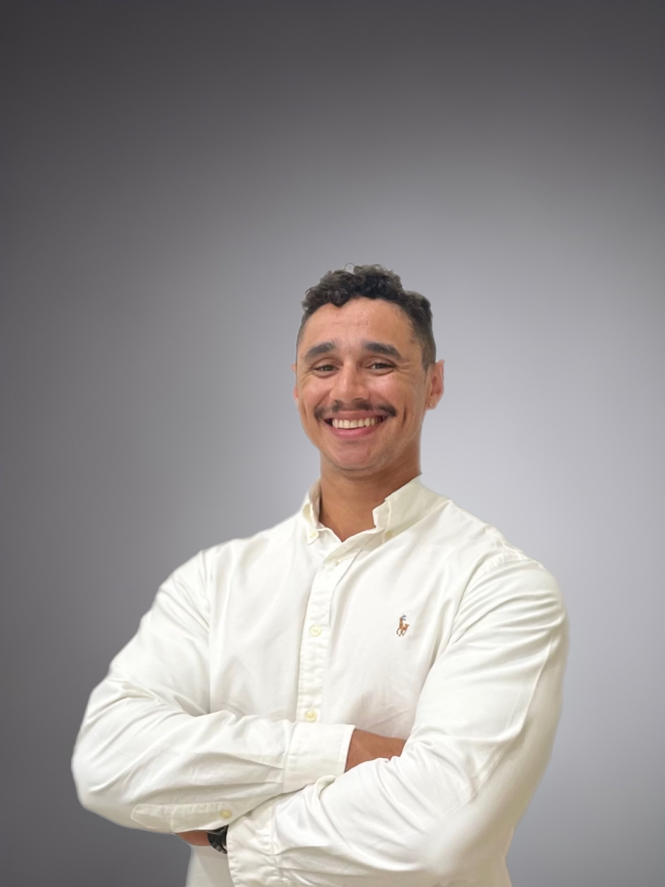
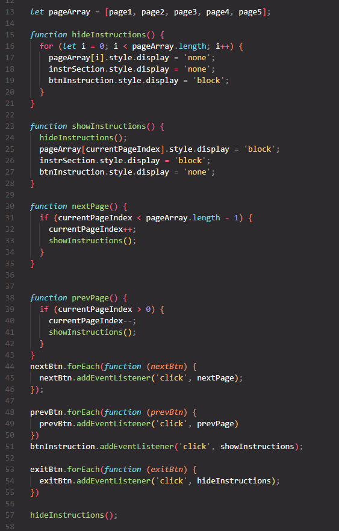
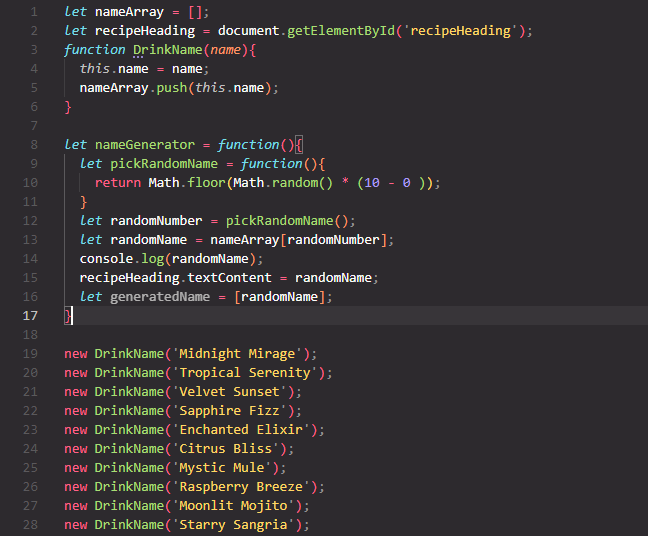
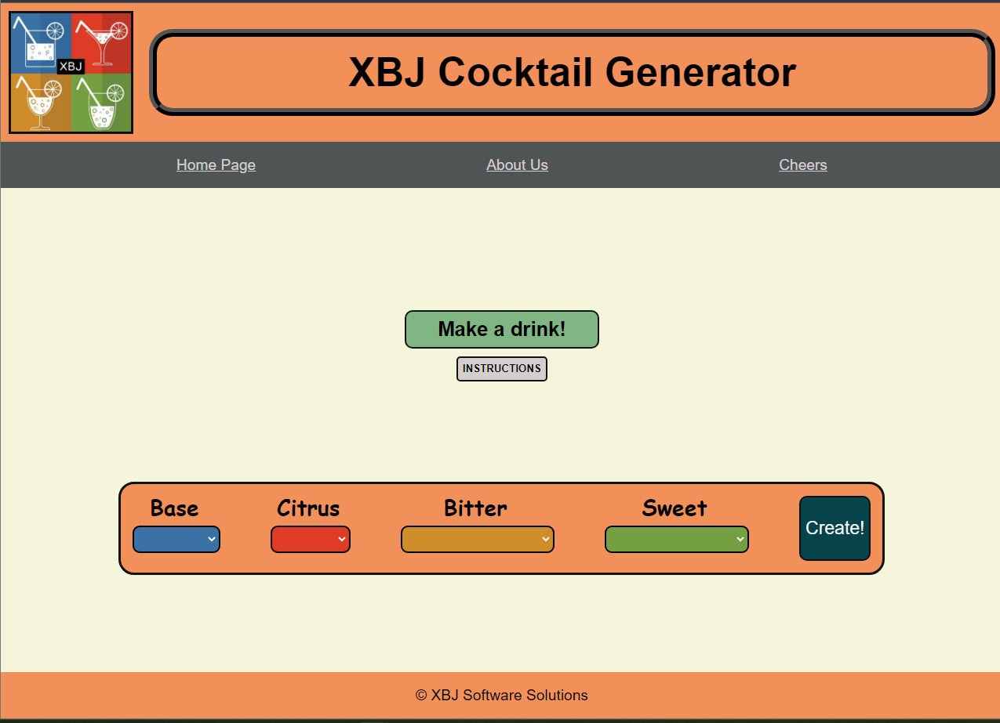
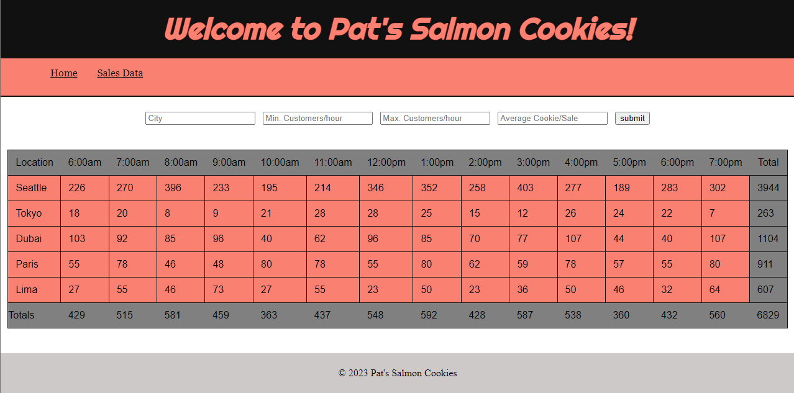
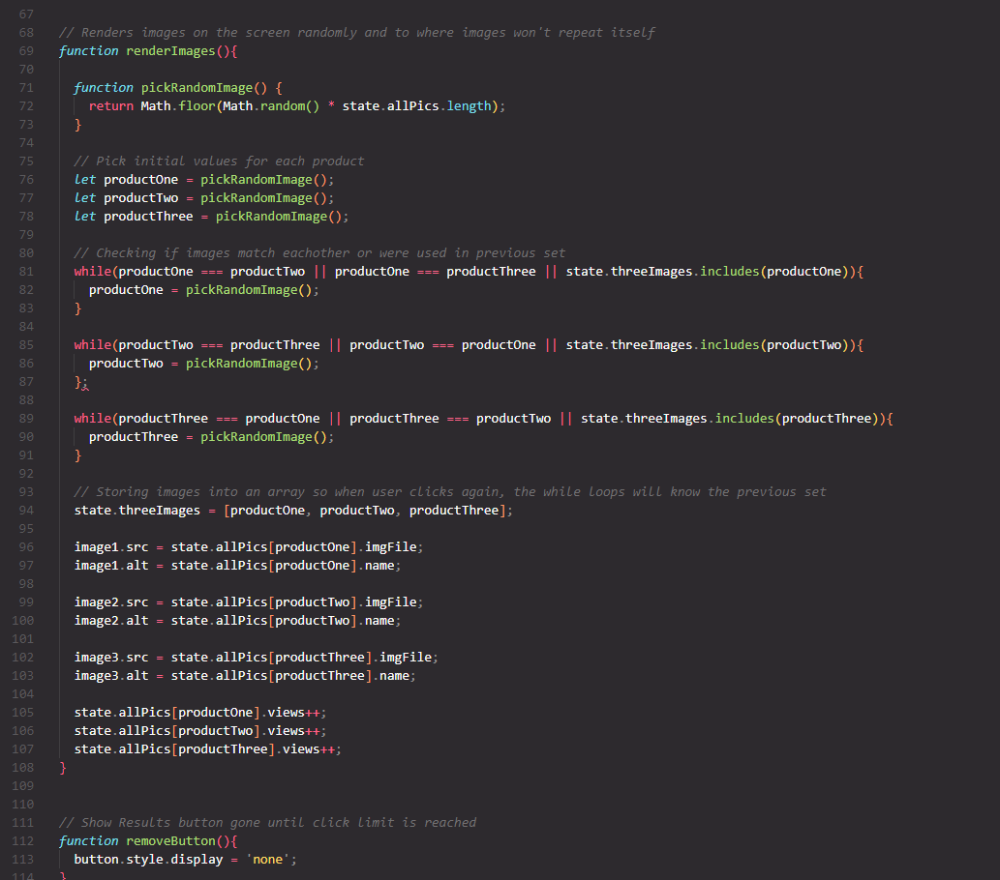
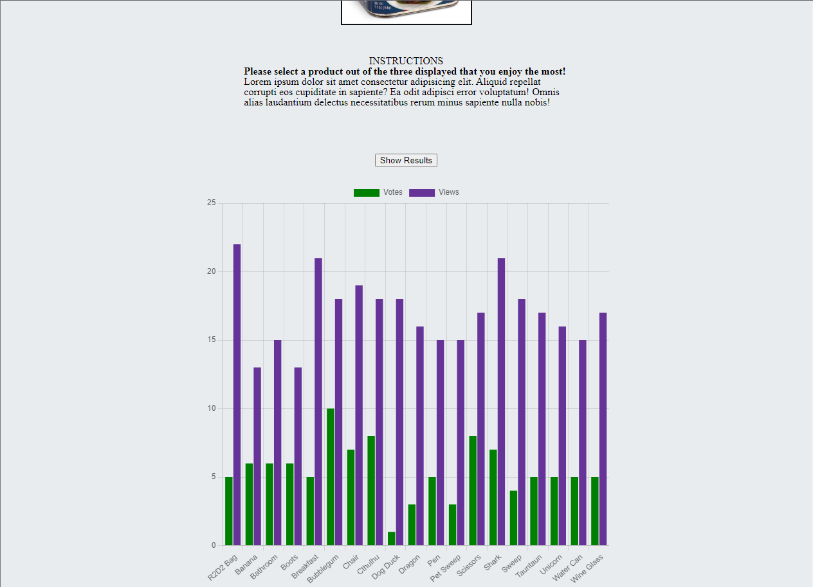

# portfolio-prep

## Info

1. Innovate, Code, Deliver 
<!-- Thanks to chatGPT for giving me ideas -->

2. Full Stack Developer | Veteran | PSM I | AWS CCP | Secret Clearance

3. Hello, my name is Brendan Huddleston.  I am a United States Army Veteran of 6 years but more importantly I am a Software Developer.  I am proficient in HTML, CSS, JavaScript and I am currently attending classes to further improve on these skills as well as grow and expand my knowledge just as the Tech Industry is ever changing.  My experience in the Army has equipped me with valuable skills that I believe are highly transferable to the software development field like the ability to work under high pressure situations, efficient critical decision making, and the skill of being very adaptable to ever changing environments.  I strive while being a part of a dynamic team, with a no quit mentality and do not settle for the bare minimum.  I look forward to continuing to learn, grow and eventually play a vital role in shaping the future of the software development field.  

4. The things that excite me the most about being in tech are the constant learning and growth that occurs in the industry.  I am an avid learner and enjoy the satisfaction after completing a challenging task.  Another thing that excites me is being a part of a unique team of individuals.

## Images

